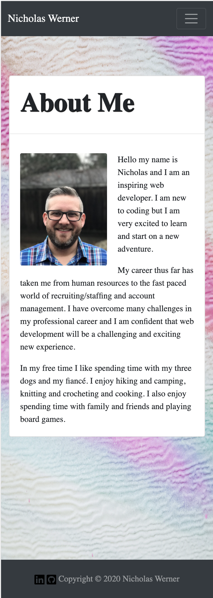

# Responsive Portfolio

Created a responsive portfolio site for myself with a navbar, a responsive layout and responsive images. 

## Images

## Description

* Created the navbar using bootstrap that links the about me page to the portfolio and contact pages. 
* Created base structure for About Me page with bootstrap elements.
* Created base structure for Portfolio page with bootstrap elements.
* Created base structure for Contact page with bootstrap elements. 
* Added styling elements to a CSS page. 
* Added social media links to pages. 

## License
[MIT](https://choosealicense.com/licenses/mit/)